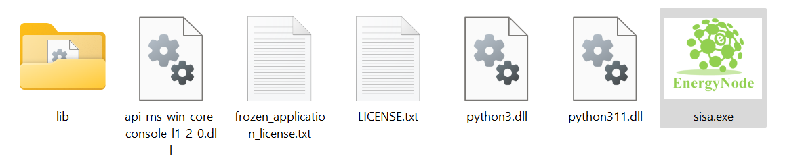
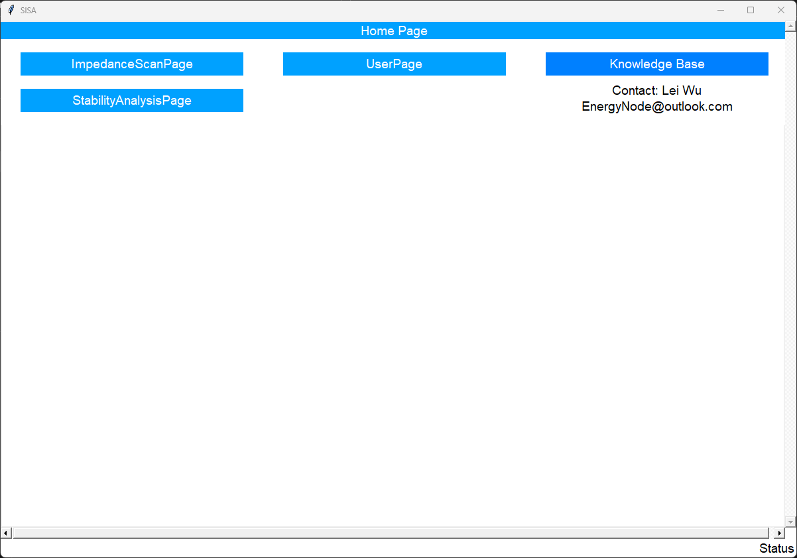

To use `SISA`, you have to agree with our license.

Visit our [release page](https://github.com/EnergyNode/sisa_public/releases) to download the app, as well as examples. It is always recommended to download the latest release.

Download the `sisa_<release version>.zip` from our website. Unzip the file and double-click the `sisa.exe` file and start to use. That's it! No need of installation/setup.

Figure: SISA file. {#fig_sisa_file}

{ width="800" }

Figure: SISA home page. {#fig_sisa_file}

{ width="800" }