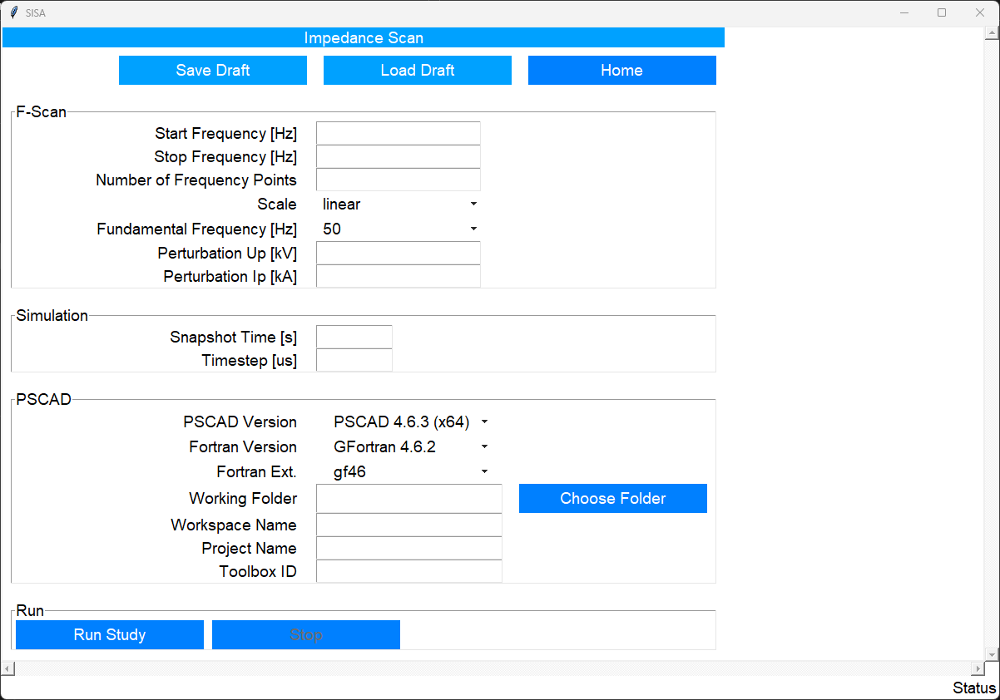
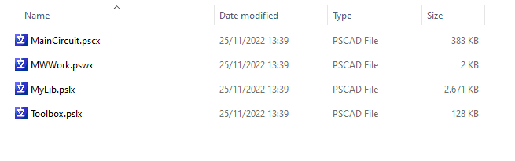
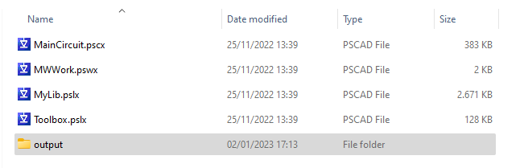
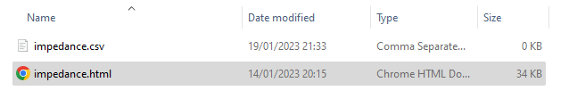
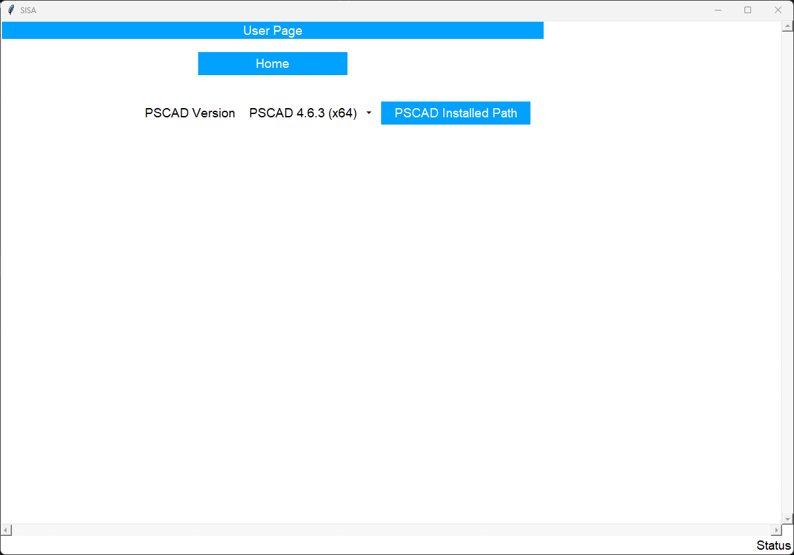

The `Impdance Scan` page allows the user to perform impedance scan with external third party software. Currently, only `PSCAD` is supported. And we are busy with implementing `MATLAB` support. Please contact us if you need the support for other software.

Figure: SISA impedance scan page. {#fig_impedance_scan_page}

{ width="800" }

## F-Scan
Please provide the input data for frequency-domain related parameters. The `Number of Frequency Points` tells `SISA` how many frequencies between `Start Frequency` and `End Frequency` should be generated, while `Scale` specifies the style of the frequency step.

The perturbation signal can be defined by `Perturbation Up [kV]` for voltage or `Perturbation Ip [kA]` for current.

## Simulation
It instructs how an external third-party software should run the time-domain simulation. For EMT simulations, the system in the simulation starts from zero and gradually establishes a steady state, after which EMT events (e.g., closing a circuit breaker) can occur. For many rounds of simulation based on the same system, running every simulation from zero is a massive waste of time. Instead, we can let the first simulation run from zero to a steady state and stop. The system's status at the stop moment is called a `snapshot`. All the remaining simulation rounds start directly from the snapshot instead of zero.

## PSCAD
The user can provide input data specifically related to `PSCAD` software. Only the `PSCAD Version` of `PSCAD 4.6.3 (x64)` is currently supported.

The `Working Folder` must contain these files:

. A workspace file `.pswx`. The file name (without file extension `.pswx`) should be entered in the `Workspace Name` field.
. A project file `.pscx`. The file name (without file extension `.pscx`) should be entered in the `Project Name` field.
. The two library files `MyLib.pslx` and `Toolbox.pslx` can download for free on our website.

The user can use the `Choose Folder` button to enter the full path.

Figure: PSCAD folder. {#fig_pscad_folder}

{ width="800" }

You need to add an instance of the toolbox from the library file to your project file at a place in `PSCAD` based on your needs. Then `PSCAD` will automatically assign a component ID for this toolbox, and you need to provide the ID to the `Toolbox ID` field.

## Run and Stop
After providing the input data, the user can click the `Run` button to start. The following steps will happen automatically:

* Launch a new instance of `PSCAD`. Note that `PSCAD 4` does not allow an already-launched `PSCAD` instance to be connected.
* Create a snapshot.
* Run a steady-state simulation to have a reference status.
* Run through all frequencies described by the user with the perturbation signal.
* Perform `FFT` analysis and output results.

When the application is running, the `Run` button will be disabled and `Stop` button will be enabled. The user can click the `Stop` button to terminate the simulation at any time.

## Output
After the run is finished, `SISA` will create an `output` folder right in the `Working Folder` and put all the results there.

* The file `impedance.csv` contains the impedances of all frequencies.
* The file `impedance.html` visualizes the data stored in `impedance.csv` file in an interactive way powered by the open-source tool `bokeh`.

Figure: PSCAD output folder. {#fig_pscad_output_folder}

{ width="800" }

Figure: PSCAD output. {#fig_pscad_output}

{ width="800" }

## PSCAD Installation Path
When `SISA` tries to launch `PSCAD`, it first uses a common path that `PSCAD 4` is installed on a computer. However, if your `PSCAD` is installed at a different path, please visit `UserPage` to let `SISA` know.

Figure: SISA user page. {#fig_user_page}

{ width="800" }

!!! quote "PSCAD"

    There are different scenarios for the program folder naming convention:
    
    1. When the MyUpdater utility is used to install PSCAD, the program file format has that “…Testing” folder, as shown:
        `C:\Program Files (x86)\PSCAD463 x64 Testing\bin\win64\Pscad.exe.`
    
    2. When the InstallShield Wizard is used to install PSCAD on a new machine (no other PSCAD patches installed):

        * the default installation folder would be: `C:\Program Files (x86)\PSCAD50\`

        * the default application folder would be: `C:\Program Files (x86)\PSCAD50\bin\`
    
    3. When the InstallShield Wizard is used to install a higher patch of PSCAD 5.0.x (e.g. v5.0.2) on a machine that already has an earlier patch (e.g. v5.0.1), the installer will ask if you if you want to either:

        * Update the existing PSCAD 5.0.1 installation, then the same default folders as per Step 2 above would be used,
        * Or, perform a side-by-side installation of both patches, then 

            * the default installation path for the new patch would be: `C:\Program Files (x86)\PSCAD503\`

            * the default application path for the new patch would be: `C:\Program Files (x86)\PSCAD503\bin\win64`
    
    4. When performing a silent installation, you can specify any installation folder via command line arguments.
