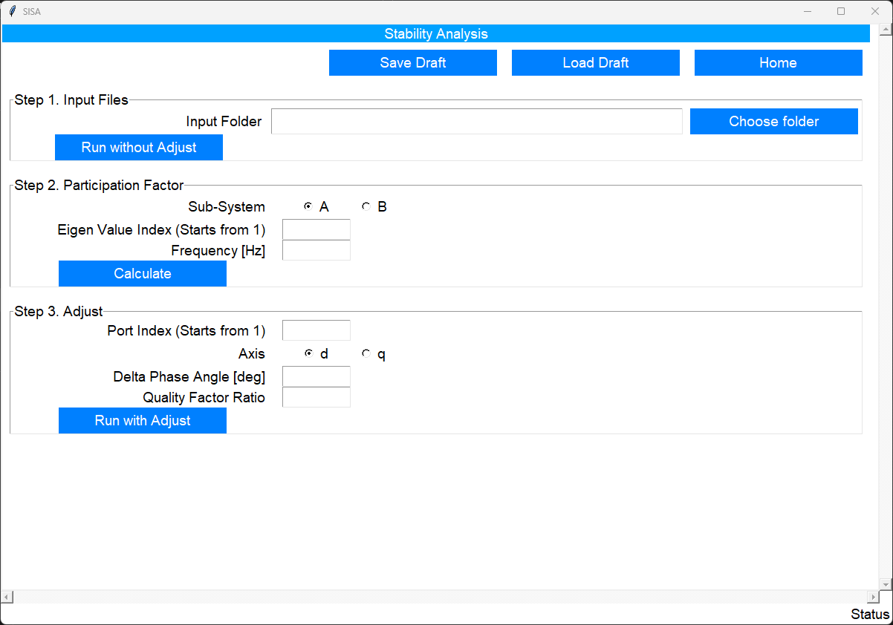
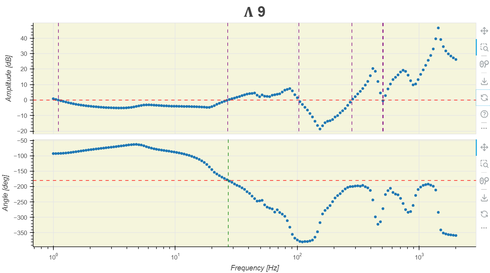
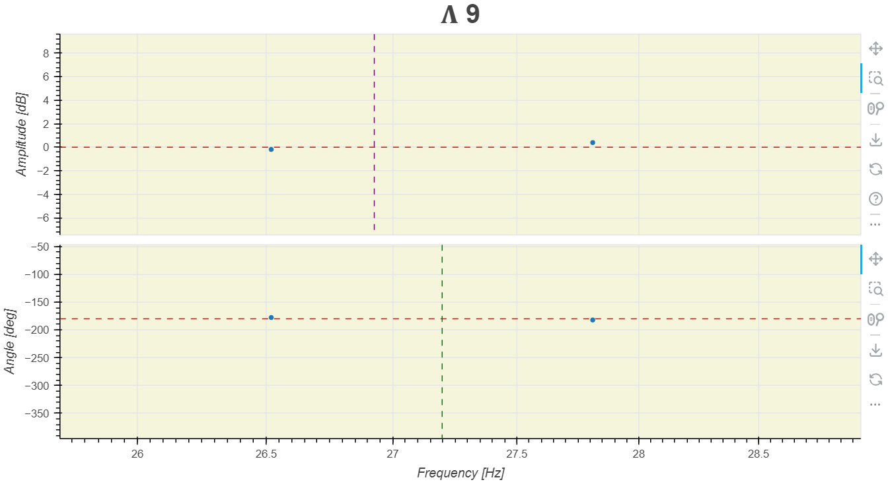
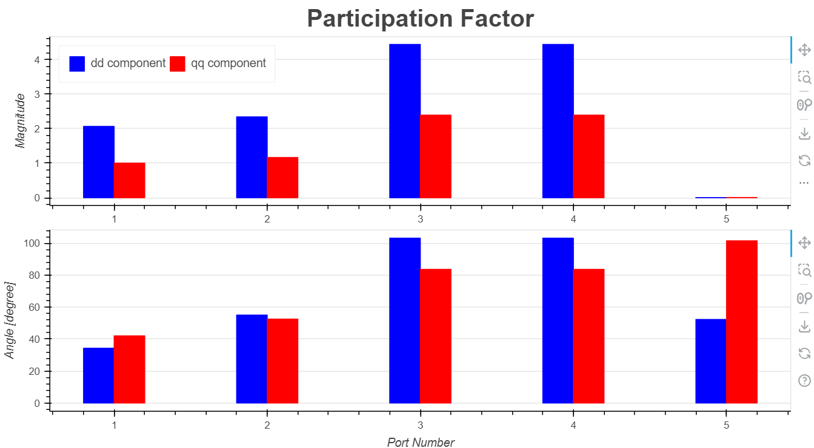
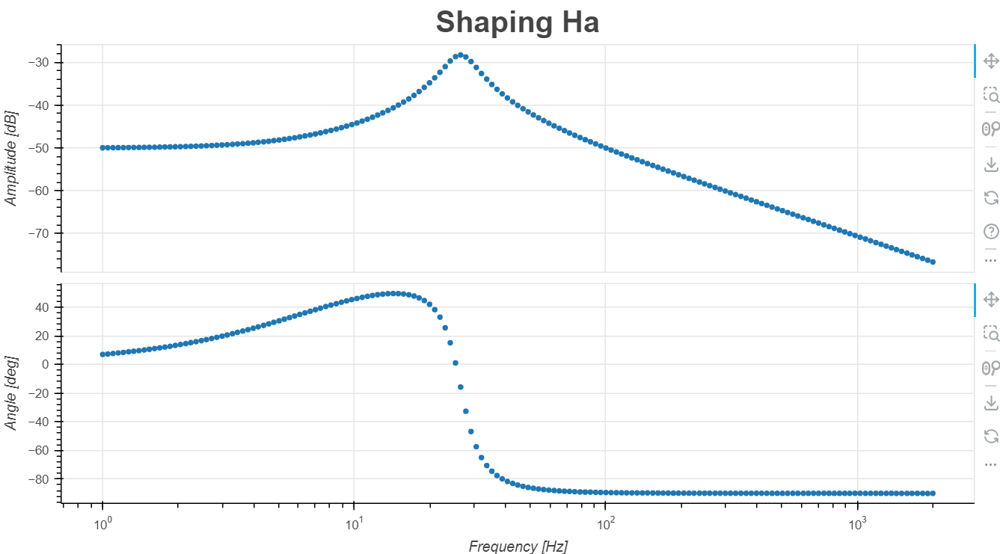
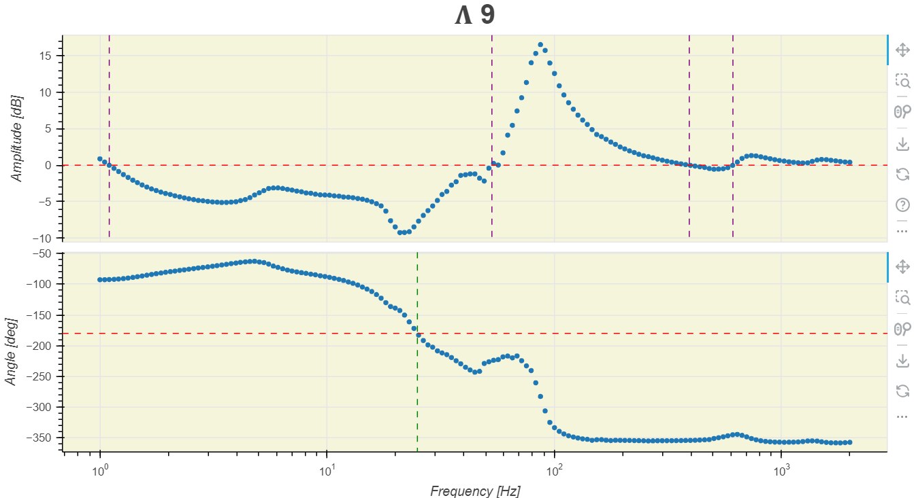

The `Stability Analysis` page allows the user to perform stability analysis based on the frequency-spectra of impedances, which are essentially CSV-files. These files can be generated by the `Impedance Scan` function of this tool, or by any other simulation software, or by actual measurements.

Here is focused on _how to use_. Please refer the publication [[@yang2022siso]] for detailed domain-knowledge.

## Steps
You can follow these steps to use this tool.

1. System Partition: split the system into 2 subsystems: $A$ and $B$.
1. Frequency scan: map the multi-input multi-output (MIMO) of all the connection ports between subsystem $A$ and $B$, i.e. $H_a$ and $H_b$ respectively.

    !!! Note
        You can use different ways to obtain the frequency scan CSV files:

        - the `Impedance Scan` function of this tool,
        - or by any other simulation software,
        - or by actual measurements.

1. Use the `Stability Analysis` feature of `SISA`.

## System Partition
<!-- TODO: check if subsystem B cannot contain active components.-->
The first step you need is to split the whole system into 2 subsystems. According to the Right Half Plane (RHP) pole-free partition rule the subsystem $A$ has all the active components, and the subsystem $B$ contains only the passive components. 

## Frequency Scan
The aim is to get the transfer-function matrices $H_a$ and $H_b$ in frequency-domain. It is usually very difficult to directly obtain them. A common practice is to run a frequency scan for each port in a subsystem resulting one CSV file per port per subsystem. And then, use these files as building blocks to construct $H_a$ and $H_b$. This is the way adopted by `SISA`.

### Frequency Scan File
A frequency scan file is a CSV file. The file name follows this convention `<ZorY>_xxx.csv`. The first character must be the letter `Z` or `Y`. The choice depends on the nature of the frequency-scan, use `Z` for impedance and `Y` for admittance. The second character must be an underscore `_`. The rest characters are left to the user's discretion. The file extension must be `.csv`.

The file content is comma separated tabular data. The impedance or admittance is represented in the $d$-$q$ system over different frequencies. Thus, the impedance or admittance at each frequency is a 2-by-2 matrix of complex values, indicated by an underline `_`. See the matrix below where $\underline{X}$ represents $\underline{Z}$ or $\underline{Y}$.

$$
\left[\begin{array}{cc}
    \underline{X}_{dd} & \underline{X}_{dq} \\
    \underline{X}_{qd} & \underline{X}_{qq} \\
\end{array}\right]
$$

The data in the file starts directly from the first row, thus no column headers are allowed. The column sequence is:

| frequencies | x_dd_mag | x_dd_ang | x_dq_mag | x_dq_ang | x_qd_mag | x_qd_ang | x_qq_mag | x_qq_ang |
| ----------- | -------- | -------- | -------- | -------- | -------- | -------- | -------- | -------- |

!!! note
    - `mag` means the magnitidue of a complex value. The unit is $[\mathrm{dB}]$.
    - `ang` means the phase angle of a complex value. The unit is $[\mathrm{degree}]$.

The user has the flexibility to obtain these files through various means, including computer simulations or actual measurements. For example, you can build the system in a `SISA`-supported simulation software and use the provided `Impedance Scan` feature of `SISA` to get them.

!!! info
    All frequency scan files must have exactly the same frequency points.


### H Config File
After obtaining the impedance/admittance scan files of all the connection ports between subsystem $A$ and $B$, you can construct $H_a$ and $H_b$ by appropriately positioning those $\underline{Z}$ and $\underline{Y}$ matrices into a larger matrix. You need to create two CSV file to config $H_a$ and $H_b$ matrices, respectively. The file names must be `ha_config.csv` and `hb_config.csv`.

Suppose the $\mathbf{H_a}$ matrix is mathematically 

$$
\mathbf{H_a} = 
\left[\begin{array}{cc}
    \mathbf{Y}_{\mathrm{type3}} & \mathbf{O} & \mathbf{O} & \mathbf{O} & \mathbf{O} \\
    \mathbf{O} & \mathbf{Y}_{\mathrm{type4}} & \mathbf{O} & \mathbf{O} & \mathbf{O} \\
    \mathbf{O} & \mathbf{O} & \mathbf{Y}_{\mathrm{type4}} & \mathbf{O} & \mathbf{O} \\
    \mathbf{O} & \mathbf{O} & \mathbf{O} & \mathbf{Y}_{\mathrm{type4}} & \mathbf{O} \\
    \mathbf{O} & \mathbf{O} & \mathbf{O} & \mathbf{O} & \mathbf{Z}_{\mathrm{grid}} \\
\end{array}\right]
$$

where 

- $\mathbf{Y}_{\mathrm{type3}}$, $\mathbf{Y}_{\mathrm{type4}}$, and $\mathbf{Z}_{\mathrm{grid}}$ are $2\times2$ matrices. And you have already obtained the frequency scan files of them as in section [Frequency Scan File](#frequency-scan-file), and their file names are `Y_type3.csv`, `Y_type4.csv`, and `Z_grid.csv`, respectively.
- $\mathbf{O}$ is a $2\times2$ null matrix. You don't need a frequency scan file for $\mathbf{O}$.

Then your `ha_config.csv` file content should be

```csv
Y_type3,,,,
,Y_type4,,,
,,Y_type4,,
,,,Y_type4,
,,,,Z_grid
```

!!! Note
    The position of each null-matrix is empty.


## SISA Stability Analysis Page

After preparing the `frequency-scan` files and `h-config` files, you are ready to use the SISA `Statbilty Analysis Page`, see [](#fig_stability_analysis_page).

Figure: SISA Stability Analysis Page. {#fig_stability_analysis_page}

{ width="800" }

You need to follow 3 separate steps, one by one.

1. Run without Adjust - Assess the stability of the system in its current state without applying any mitigation measures.
1. Calculate Participation Factor - Analyse the most contributive component for an oscillation.
1. Run with Adjust - Assess the stability of the system after applying the implemented impedance shaping method.

### Run without Adjust
All the frequency scan (impedance/admittance) files and the h-config files (`ha_config.csv` and `hb_config.csv`) must be placed in the same folder as the `Input Folder`. You need to simply provide it by clicking the `Choose folder`, and then click the button of `Run without Adjust`.

The frequency spectra of all eigen values ($\Lambda$) of the tranfer function matrix $\mathbf{H}$, where $\mathbf{H} = \mathbf{H_a} \mathbf{H_b}$, are plotted with interactive figures in one HTML file. It will be opened automatically with your default browser (e.g. Google Chrome). These figures can help you to find out the oscillication frequency and which eigen value contributes the most.

The default view of a figure contains two subplots: amplitude and phase angle, see [](#fig_sisa_find_oscillation_frequency) as an example. The frequency points are directly from the input frequency scan files. Each frequency has a blue dot. Since they are discrete values, the exact crossing frequency at the reference level (marked by an horitonal red line) is interpolated and indicated by a vertical line, and you can use the nearest blue dot on each side of the vertical line comparing with the reference line to determine the crossing direction. [](#fig_sisa_find_oscillation_frequency_zoomed_in) shows that somewhere after 26.5 Hz, the amplitude crosses from below to above, while the phase angle crosses from above to below. And the amplitude crosses at a smaller frequency that the phase angle. Therefore, you know the eigen value $\Lambda9$ contributes the most at the oscillation frequency near 26.5 Hz.

Figure: Exemplary figure of an eigen value (default view). {#fig_sisa_find_oscillation_frequency}

{ width="800" }

Figure: Exemplary figure of an eigen value (zoomed-in view around the oscillation frequency near 26.5 Hz). {#fig_sisa_find_oscillation_frequency_zoomed_in}

{ width="800" }


### Calculate Participagion Factor
After visually identifying the most contributive eigen value and the oscillation frequency, you can calculate the participation factor.

- Decide which subsystem you want to adjust (`A` or `B`).
- The index of the eigen value.

    !!! note
        It should be an integer. Just use the number of the $\Lambda$ in the corresponding figure. E.g. use the number `9` for $\Lambda9$ for the example of [](#fig_sisa_find_oscillation_frequency_zoomed_in).

- The oscillation frequency.

    !!! note
        Since the frequency points are discrete, the exactly oscillation frequency is usually not available from the frequency scan files, you need to use the nearest available value. In the example of [](#fig_sisa_find_oscillation_frequency_zoomed_in), you need to use 26.5 Hz.  

Click the button `Calculate` will result in a new HTML file with a figure of participation factor, see [](#fig_sisa_plot_participation_factor) as an example.

Figure: Exemplary figure of a participation factor. {#fig_sisa_plot_participation_factor}

{ width="800" }

Here you can clearly see the `dd component` of `Port Number` `3` and `4` has the highest value, indicating that they both are the dominant contributors. You can shape them to damp the oscillation most effectively. Suppose you want to choose port number `3` for the next step.

### Run with Adjust
After identifying the component to adjust by the participation factor figure, you can proceed with finding a proper adjudtment to damp the oscillation using the following input.

- The index of the port, which is the Port Number in [](#fig_sisa_plot_participation_factor).

    !!! note 
        It should be an integer. E.g. use the number `3` from the example of [](#fig_sisa_plot_participation_factor).

- The axis: `d` or `q`. Based on the example of [](#fig_sisa_plot_participation_factor), you choose `d`.
- Delta phase angle - This is the increment of phase margin $\Delta \mathrm{PM}$ in equation (26) in [[@yang2022siso]]. 
- Quality factor ratio - This is the ratio to calculate the quality factor.

    $$
        \omega_i = \mathrm{ratio} \times 2\pi f_c
    $$
    
    where $f_c$ is the oscillation frequency, and $\omega_i$ is the quality factor from equation (28) in [[@yang2022siso]].

Click the button `Run with Adjust` will result in two HTML files.

- Frequency reponse of the shaping function shown in equation (28) in [[@yang2022siso]].

    Figure: Exemplary figure of the frequency response of the shaping function. {#fig_sisa_plot_shaping_ha}

    { width="800" }

- Frequency spectra of all the eigen values ($\Lambda$) of the adjusted transfer function $\mathbf{H}$.

    Figure: Exemplary figure of an eigen value of the adjust transfer function. {#fig_sisa_oscillation_frequency_adjusted}

    { width="800" }

[](#fig_sisa_oscillation_frequency_adjusted) shows that the crossing frequency of the amplitude becomes larger than the crossing of frequency of the phase angle, comparing to [](#fig_sisa_find_oscillation_frequency). This is the effect of the adjustment.
